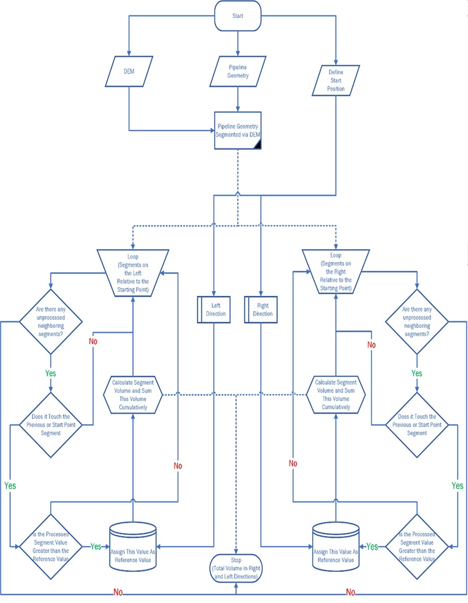
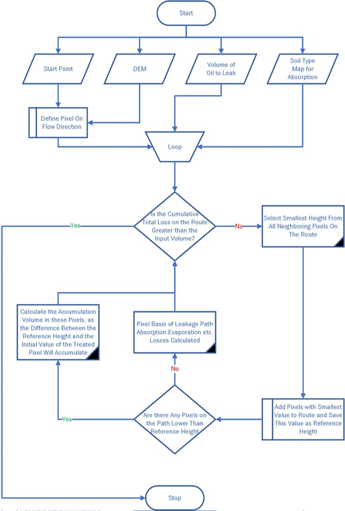

#Flow Chart of Pipeline Spill Volue Calculation

  

Step 1: Input data supply
DEM data of the target region, pipeline vector drawing with coordinates, and leak location coordinates on the pipeline are provided as input.

Step 2: Overlapping Pipeline Geometry and DEM Data
The pipeline geometry and DEM data are overlapped to identify the areas where they coincide.
This overlapping process helps segment the pipeline based on the DEM data.

Step 3: Intersection with Starting Point and Reference Value Recording
The DEM data is intersected with the starting point of the pipeline.
A randomly selected segment, either in the right or left direction, is designated as the processed segment.
The height value at the intersection point is recorded as the reference value.

Step 4: Calculation of the Volume for the Selected Segment
The volume of the selected pipeline segment is calculated.
This volume is recorded as the total leakage volume.
The selected segment is marked as processed to avoid redundancy.

Step 5: Loop for Segment Inspection
The algorithm enters a loop to inspect all parts of the pipeline route segmented with DEM data.

This loop iterates through the following sub-steps:
  5a: Check if Segment Has Been Processed
The algorithm checks whether the selected segment has been processed before.
If it has not been processed, a new segment is randomly selected, and the loop restarts from Step 5.
If it has been processed, the algorithm proceeds to the next sub-step.
  5b: Geometric Touch Check
The algorithm checks whether the loop segment geometrically touches the processed segment.
If there is no touch, a new unprocessed segment is randomly selected, and the loop restarts from Step 5.
If there is a touch, the algorithm moves to the next sub-step.
  5c: Path Update and Volume Calculation
Within each iteration of the loop, the algorithm updates the path based on the height value of the processed segment.
If the height value of the processed segment is smaller than the reference height value, the path is updated.
If the height value is greater than or equal to the reference value, the height of the processed segment becomes the new reference height value.
The volume of the processed segment is calculated, and the total leakage volume value is added to this volume.
The newly calculated volume is recorded as the total leakage volume.
The processed segment is marked as selected, and the loop restarts with the newly selected segment.

Step 6: Switching to Unselected Direction

After inspecting all segments in one direction, the algorithm switches to the unselected direction (right or left).
The height value of the intersection point between the DEM data and the starting point is reassigned as the reference value.

Step 7: Repeating Step 5 for the New Direction

#Flow Chart of Horizontal Oil Spill Distribution

  

Step 1: In the initial stage of this analysis, various inputs are fed into the application. These inputs consist of Digital Elevation Model (DEM) data, information on the volume of the oil that has leaked, a map detailing different soil types in the area, and where the leak started. These inputs serve as a basis for the algorithm to conduct its operations.

Step 2: The second step involves integrating the DEM data and the soil type map to create a surface model. This model illustrates the terrain's elevation and the type of soil found at each location. This is achieved by conducting an intersection analysis within the Geographical Information System (GIS), which overlays the two data types to create a combined visual representation. The rectangular pixels may become somewhat distorted at this stage due to the complex interactions between different data layers. However, such distortion is considered insignificant for this algorithm.

Step 3: Following this, an intersection analysis is performed between the leak's starting point and the DEM data within the GIS. This process identifies the pixel where the leak starts and tracks its path on the model. The elevation value of this pixel is then noted down and set as the reference height for further steps in the algorithm.

Step 4: The algorithm then runs in a loop until the total volume of the leak, calculated by the system, meets or exceeds the leaked volume input at the beginning of the process. The various steps within this loop are as follows:
   4a: The algorithm first identifies the pixel with the smallest elevation value along the path of the leak. The elevation value of this pixel is then set as the reference height for the next stage of the algorithm.
   4b: If other pixels along the leak path have an elevation equal to the reference height, they are marked as the reference path. The algorithm then goes into an iterative process, examining the surrounding pixels and adding any with equal height to the reference path. This is performed using an endless loop or a recursive function, a coding technique that allows a function to call itself. This process is akin to a breadth-first search algorithm, a strategy for searching in a graph when breadth (neighbors to a node) is prioritized before depth (children of a node).
   4c: At this stage, the algorithm calculates the volume of oil accumulated in pixels with a height less than the reference height along the leak path. This is computed by multiplying the pixel area being processed by the difference between the reference height and the height of the pixel in question. The formula can be written as:
      Pixel-based Puddle Volume = Area of the Processed Pixel * (Height of Reference Pixel - Height of the Processed Pixel)
   4d: The algorithm then calculates the amount of oil absorbed by each section of the DEM, based on the unit volume absorption amount for the specific type of soil in that location.
   5e: At this point, the algorithm accounts for additional losses due to small surface cracks, evaporation, and oil adhering to vegetation. This is done by defining a constant loss parameter proportional to the calculated path length. The total losses are then calculated by multiplying the path length by the constant loss parameter.
   5f: The loop is terminated as soon as the combined volumes of oil lost in steps 5c, 5d, and 5e meet or exceed the total volume of the oil leak as given in the input parameters.
In the developed Algorithm, the soil type is an optional parameter. A fixed absorption rate is given if this data does not exist.

