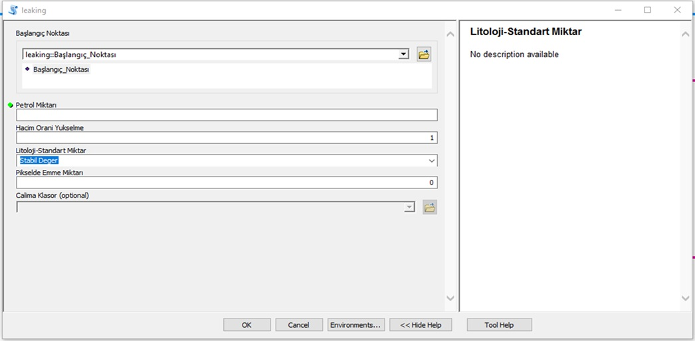

## How to Use the Application

The user interface of the application developed in ArcGIS can be opened using the ArcGIS Desktop application.  
To use the toolbox, add the `oil_leaking.tbx` toolbox to your ArcGIS project.

