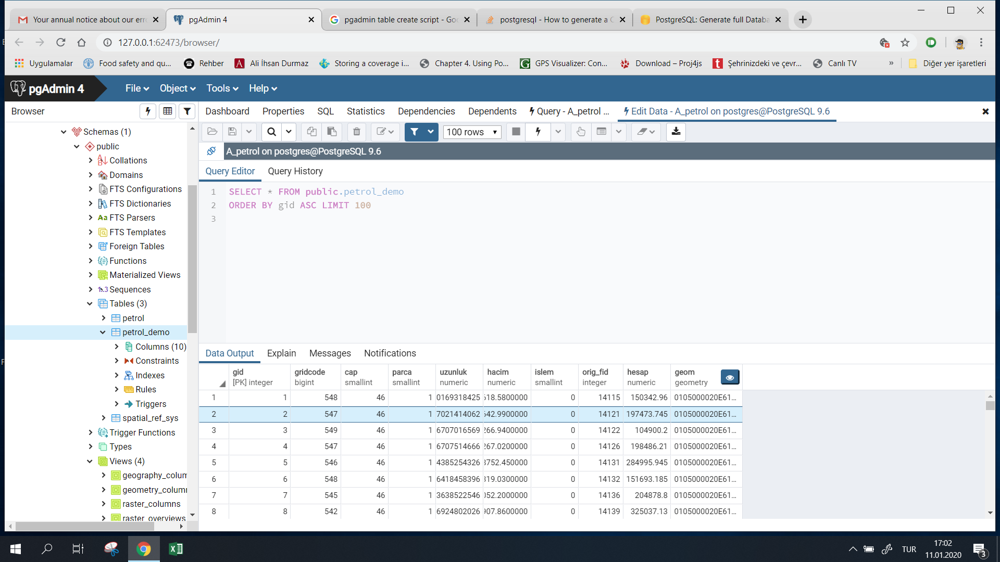

## Oil Spill Volume Calculation

To calculate the oil spill volume, a PostgreSQL database with the PostGIS extension is required.  
The `volume_db_table_create.sql` script is used to create the necessary table in the database.  

The table creation process is illustrated below:  
  

Next, a GIS application is used to process the pipeline route data whose volume needs to be calculated.  
The pipeline route is intersected with a DEM (Digital Elevation Model), where elevation data is imported into the `gridcode` column, and the segmented pipeline geometry is imported into the `geom` column.